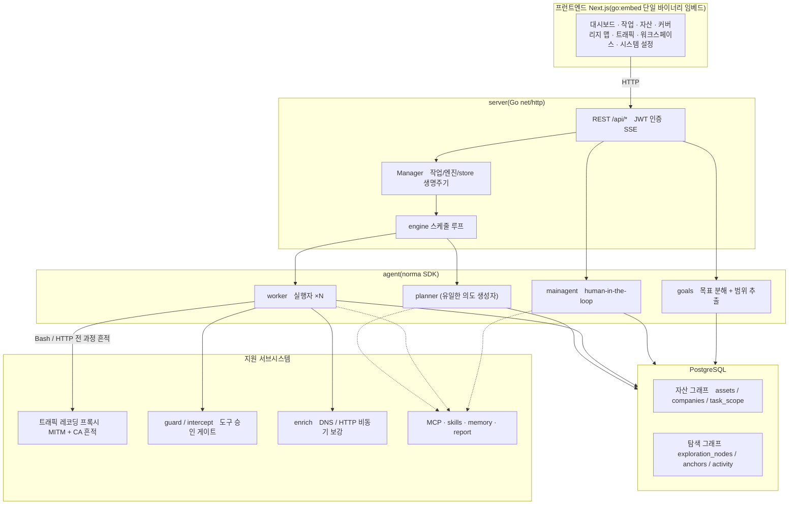
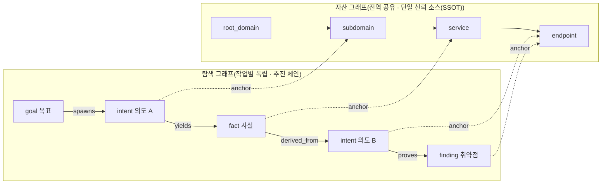
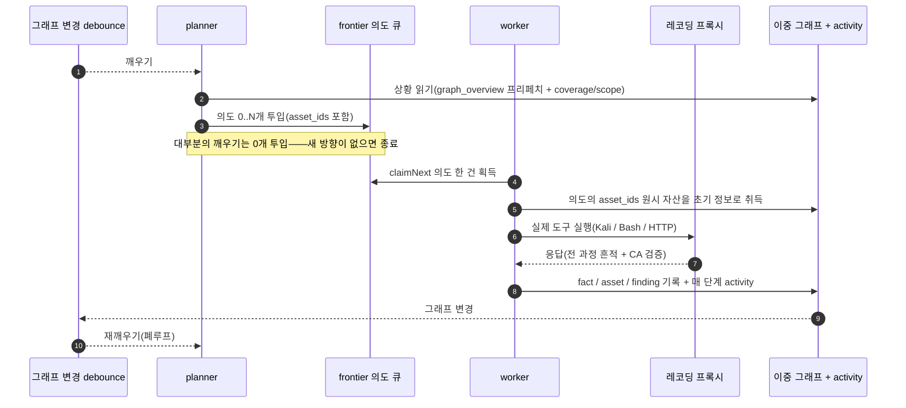
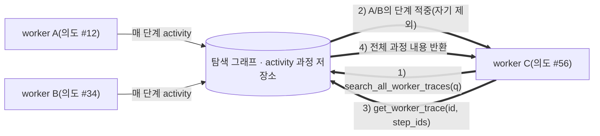
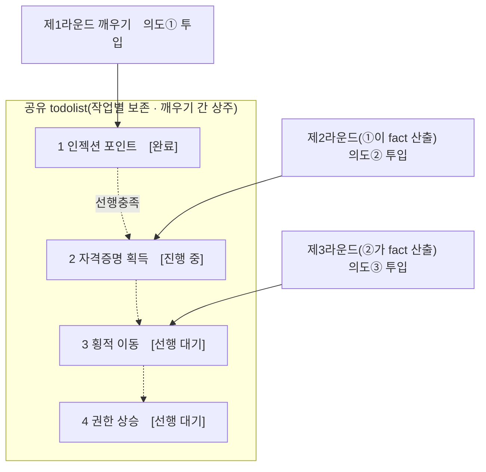

<div align="center">

# ARTEX

AI 자율 침투 테스트 시스템 (Go 백엔드 + Next.js 프런트엔드)


🌐 **온라인 데모**: [https://artex-demo.vercel.app/](https://artex-demo.vercel.app/)

</div>

<!-- README-I18N:START -->

[简体中文](./README.md) | **한국어**

<!-- README-I18N:END -->

---

## 스크린샷 미리보기

> 전체 인터랙션은 [온라인 데모](https://artex-demo.vercel.app/)에서 확인하세요.

| 대시보드(개요 / 토큰 소비 / 활동 스트림) | 작업 목록 |
| :---: | :---: |
|  |  |

| 작업 · 실행 과정(세션 / 도구 호출) | 탐색 체인 |
| :---: | :---: |
|  |  |

| 발견 | 자산 |
| :---: | :---: |
|  |  |

| 자산 커버리지 맵(force-directed 레이아웃 · 테스트 완료 하이라이트 · 노드 접기/펼치기) |
| :---: |
|  |

| 트래픽 레코딩 | human-in-the-loop 대화 |
| :---: | :---: |
|  |  |

| Agent 관리 | LLM 설정 |
| :---: | :---: |
|  |  |

| 인터셉트 승인 | 백엔드 로그 |
| :---: | :---: |
|  |  |


---

## 승인 기록 상세

전역 '승인 기록', 작업 내 '인터셉트 승인', 그리고 대화 속 승인 카드는 모두 펼쳐서 상세 내용을 볼 수 있습니다. 표시 구조는
[AegisHook의 승인 상세 컴포넌트](https://github.com/RuoJi6/AegisHook/blob/main/web/src/components/CallDetail.vue)를 참고했으며, ARTEX의 컴포넌트와 테마를 그대로 사용했습니다:


## 자산 동기화(ScopeSentry)

[ScopeSentry](https://github.com/Autumn-27/ScopeSentry)에서 자산 데이터를 직접 동기화하여 중복 수집을 줄일 수 있습니다:

- '**자산 동기화**' 페이지에서 ScopeSentry의 주소와 API Key를 입력해 데이터 소스에 연결합니다;
- **프로젝트** 또는 **작업** 단위로 동기화할 대상과 자산 유형(도메인 / 서브도메인 / IP / 포트 / 사이트 / 엔드포인트…)을 선택합니다;
- 원클릭으로 가져와 회사 자산 범위에 맞춰 병합하고, 곧바로 ARTEX의 자산 그래프에 넣어 agent가 탐색에 사용하도록 합니다.

---

## 설치

> 데이터베이스로 **PostgreSQL**이 필요하며; 탐색에는 **LLM** 설정이 필요합니다(`ANTHROPIC_API_KEY` 또는 `OPENAI_API_KEY`, UI에서도 설정 가능).

### 방법 1: 원클릭 설치 스크립트(권장)

```bash
git clone https://github.com/Autumn-27/ARTEX.git
cd ARTEX
./install.sh
```

스크립트는 다음을 수행합니다: Docker 감지 / 자동 설치 → **① 전부 Docker** 또는 **② 로컬 컴파일 실행** 중 선택하게 합니다:

- **① 전부 Docker**: Postgres 비밀번호를 하나 입력(엔터 시 랜덤) → `.env` 자동 작성 → `docker compose up -d`.
- **② 로컬 실행**: 데이터베이스 선택(기존 연결 / Docker로 신규 기동) → `config.json` 생성 → `go`로 임베드 단일 바이너리 컴파일 → 기동.

설치 후 **http://localhost:8787** 을 엽니다(최초 진입 시 `/setup`에서 관리자 비밀번호 설정).

### 방법 2: Docker Compose(수동)

```bash
git clone https://github.com/Autumn-27/ARTEX.git
cd ARTEX
cp .env.example .env          # POSTGRES_PASSWORD 입력, 선택적으로 ANTHROPIC_API_KEY
docker compose up -d          # autumn27/artex 이미지 + postgres 가져오기
# → http://localhost:8787
```

이미지에는 자주 쓰는 도구(ripgrep/curl/vim/npm/nmap…)가 포함되어 있으며; `./skills`와 `./data`는 바인드 마운트로 영속화됩니다.

원격 MCP는 시스템 설정에서 `http`(Streamable HTTP) 또는 `sse`(구버전 SSE)를 선택할 수 있습니다.
구버전 SSE 서비스는 보통 `GET /sse`로 이벤트 스트림을 수립한 뒤, 서비스가 반환하는
`/message?sessionId=...`로 JSON-RPC 요청을 받습니다; 설정 시 URL은 `/sse`로 입력하고, 요청 헤더는
`Authorization=Bearer <token>` 형식으로 작성합니다.

### 방법 3: 사전 컴파일 바이너리 다운로드(Releases)

[Releases](https://github.com/Autumn-27/ARTEX/releases)에서 해당 플랫폼의 zip을 내려받아 압축을 풀면 `artex` + `start.sh`(Windows는 `start.bat`) + `skills/` + `config.example.json`을 얻습니다:

```bash
cp config.example.json config.json   # database 연결 정보 입력
./start.sh                           # → http://localhost:8787
```

> `./artex`를 직접 실행하지 말고 `start.sh` / `start.bat`로 기동하세요. 이것은 데몬 스크립트입니다: 프로그램이 종료되면 종료 코드에 따라 다시 기동할지를 결정하며, **페이지의 [원클릭 업데이트](#방법-1-페이지-원클릭-업데이트권장)가 이것으로 교체 작업을 완료합니다**. `./artex`를 직접 실행하면 업데이트가 끝난 뒤 다시 기동되지 않습니다.
> 백그라운드 상주: `nohup ./start.sh >artex.log 2>&1 &`.

### 방법 4: 소스에서 단일 바이너리 컴파일

```bash
# 1) 프런트엔드 정적 내보내기
cd web && npm ci && npm run build:static && cd ..
# 2) 임베드 디렉터리로 복사
cp -r web/out server/webui/dist
# 3) 컴파일(-tags embedui 를 줘야 프런트엔드 임베드)
CGO_ENABLED=0 go build -tags embedui -o artex ./cmd/artex
./start.sh
```

### 방법 5: 크로스 플랫폼 Release 압축 패키지 빌드

`build.sh`는 먼저 프런트엔드를 빌드·임베드한 뒤, Go linker로 디버그 정보를 제거하고 배포 파일을 zip으로 압축합니다. Release 모드는 기본적으로 Linux amd64/arm64, macOS amd64/arm64, Windows amd64용 zip 패키지를 생성합니다:

```bash
./build.sh --release
# 산출물: dist/artex-0.3.3-*.zip
```

UPX 자가 압축 해제 바이너리는 일부 Linux 커널, 가상화 환경 또는 보안 정책과 호환되지 않을 수 있어 기본적으로 비활성화됩니다. `ARTEX_TARGETS`로 대상을 커스터마이즈할 수 있으며; 대상 실행 환경의 호환성을 확인했다면 `--upx`를 명시적으로 전달해 바이너리를 더 줄일 수 있습니다:

```bash
ARTEX_TARGETS=linux/amd64,windows/amd64 ./build.sh --release
./build.sh --target linux/amd64 --upx
```

---

## 업데이트 및 업그레이드

> 업그레이드는 프로그램만 교체하고 데이터는 건드리지 않습니다: Postgres 데이터 볼륨 `pgdata`, `./data`(jwt.key / SQLite 등), `./skills`가 모두 보존됩니다. **데이터베이스 마이그레이션은 수동으로 실행할 필요가 없습니다** — `artex`는 매번 기동 시 `schema.sql`(`ADD COLUMN` / `CREATE INDEX IF NOT EXISTS` 포함)을 멱등적으로 재실행합니다. 즉 "재시작이 곧 마이그레이션"입니다. 그래도 업그레이드 전에는 `./data`와 데이터베이스를 먼저 백업하는 것을 권장합니다.

### 방법 1: 페이지 원클릭 업데이트(권장)

**시스템 설정** 페이지(사이드바 '시스템 설정'→ `/system/settings`)의 **버전 및 업데이트** 카드에서, 서버에 로그인하지 않고도 새 버전을 바로 확인하고 설치할 수 있습니다.

'업데이트'를 누르면: 현재 플랫폼의 배포 패키지 다운로드 → Release의 `SHA256SUMS` 대조 → `-h`로 새 바이너리 스모크 테스트 → `artex.new`로 임시 저장 → 프로그램 종료, `start.sh` / `start.bat`이 다시 기동하여 교체를 완료합니다. 페이지는 새 버전이 올라올 때까지 자동으로 기다렸다가 새로고침합니다.

- **실패해도 손상된 프로그램을 남기지 않습니다**: 검증 또는 스모크 테스트를 통과하지 못하면 임시 파일을 버리고 현재 버전을 계속 실행합니다; 교체된 새 버전이 연속 3회 기동에 실패하면 자동으로 `artex.old`로 롤백합니다(실패한 것은 분석용으로 `artex.failed`로 남김).
- **언제든 되돌릴 수 있습니다**: 직전 버전은 `artex.old`로 보존되며, 카드에 '이전 버전으로 롤백'이 있습니다. 단, 데이터베이스 구조는 롤백되지 않습니다.
- **업데이트는 실행 중인 작업을 중단시킵니다** — 업데이트는 곧 재시작이므로, 유휴 시간에 진행하세요.
- **개발 빌드에는 업데이트를 제공하지 않습니다**: 버전 번호가 `dev`이거나 `git describe` 접미사가 붙은 경우 비활성화되어, 정식 버전이 로컬 디버깅 바이너리를 덮어쓰는 것을 방지합니다.
- **Docker에서는 프로그램만 교체하고 이미지는 교체하지 않습니다**: 이미지 안의 playwright / nmap 등 툴체인은 함께 업그레이드되지 않으며, `docker compose up -d`로 컨테이너를 재생성하면 이미지 기본 버전으로 되돌아갑니다. 이미지까지 함께 업그레이드하려면 `docker compose pull artex && docker compose up -d artex`를 사용하세요.
- GitHub 접속에 프록시가 필요하면, 같은 페이지에서 **전역 프록시**를 설정하면 업데이트 경로가 그것을 경유합니다. 업데이트는 GitHub 도메인에서만 다운로드하며 HTTPS를 강제합니다.

### 방법 2: 원클릭 업데이트 스크립트

```bash
cd ARTEX
./update.sh
```

스크립트는 먼저 선택적으로 `git pull`로 최신 코드를 받은 뒤, **① Docker 업데이트** 또는 **② 로컬 컴파일 업데이트**(`install.sh`에 대응)를 선택하게 합니다:

- **① Docker**: 대상 이미지 tag를 지정할 수 있습니다(엔터 시 `.env`의 `ARTEX_TAG` 사용, 기본값 `latest`) → `docker compose pull` → `docker compose up -d`(새 이미지로 교체 후 재시작하면 자동 마이그레이션).
- **② 로컬**: 프런트엔드 정적 산출물 재빌드 → `./artex` 재컴파일(완료 후 프로세스 재시작으로 적용).

### 방법 3: Docker Compose(수동)

```bash
cd ARTEX
git pull                       # compose / 스크립트 업데이트(선택)
# 버전 지정: .env 에 ARTEX_TAG=v0.2.0 설정; 미설정 시 latest 사용
docker compose pull artex
docker compose up -d artex     # 새 이미지로 교체 후 재시작 → schema 자동 마이그레이션
docker image prune -f          # 오래된 이미지 정리(선택)
```

### 방법 4: 사전 컴파일 바이너리(Releases)

[Releases](https://github.com/Autumn-27/ARTEX/releases)에서 새 버전 zip을 내려받고, 기존 프로세스를 중지한 뒤 `artex`와 `skills/`를 덮어쓰고(당신의 `config.json`과 `data/`는 보존), 재시작하면 됩니다:

```bash
cp -r <압축해제디렉터리>/skills ./ && cp <압축해제디렉터리>/artex ./
./start.sh
```

### 방법 5: 소스에서 컴파일

```bash
git pull
cd web && npm ci && npm run build:static && cd ..
cp -r web/out server/webui/dist
CGO_ENABLED=0 go build -tags embedui -o artex ./cmd/artex
# ./start.sh 재시작
```

---

## 설정

**데이터베이스**(`config.json`, 또는 환경변수 `ARTEX_PG_DSN`로 덮어쓰기):

```json
{
  "database": {
    "host": "127.0.0.1", "port": 5432,
    "user": "artex", "password": "yourpass",
    "dbname": "artex", "sslmode": "disable"
  }
}
```

**LLM**: `export ANTHROPIC_API_KEY=sk-...`(또는 `OPENAI_API_KEY`), UI의 'LLM 설정' 페이지에서도 입력할 수 있습니다.
선택: `ARTEX_LLM_PROVIDER` / `ARTEX_LLM_MODEL` / `ARTEX_LLM_BASE_URL` / `ARTEX_LLM_PROXY`.

**동시성**: 작업별 work agent 수는 '시스템 설정'에서 구성합니다(기본값 3).

**자주 쓰는 파라미터**: `./start.sh -addr :8787 -proxy :8788`(`-addr`은 프런트엔드+API, `-proxy`는 트래픽 레코딩 프록시). 기동 스크립트는 파라미터를 `artex`에 그대로 전달합니다.

### 리버스 프록시 배포(HTTPS / 443만 개방)

프런트엔드와 API/SSE는 모두 동일한 백엔드 포트(기본 `:8787`)에서 제공되며, 실시간 활동 스트림은 기본적으로 **동일 출처(same-origin)** 주소를 사용하므로 **`NEXT_PUBLIC_SSE_BASE`를 설정할 필요가 없습니다**. 공개망에는 443만 열고 8787은 내부망에 두면 됩니다.

SSE는 지속 연결 + 지속적 푸시이므로, 리버스 프록시는 **반드시 버퍼링을 꺼야 합니다**. 그렇지 않으면 브라우저가 연결은 되어도 이벤트를 받지 못합니다(활동 스트림이 계속 로딩 중으로 표시됨). Nginx 예시:

```nginx
server {
    listen 443 ssl;
    server_name your.domain.com;
    # ssl_certificate / ssl_certificate_key ...

    location / {
        proxy_pass http://127.0.0.1:8787;
        proxy_set_header Host $host;
        proxy_set_header X-Forwarded-Proto $scheme;

        # SSE 핵심 항목: 버퍼링 끄기, 긴 타임아웃, HTTP/1.1
        proxy_buffering off;
        proxy_cache off;
        proxy_read_timeout 3600s;
        proxy_http_version 1.1;
        proxy_set_header Connection "";
    }
}
```

> SSE가 페이지와 다른 출처(예: 독립 서브도메인)를 경유해야 할 때만, **빌드 시점**에 `NEXT_PUBLIC_SSE_BASE`를 설정하세요(이 변수는 `next build` 시 정적 패키지에 고정되므로 컨테이너 런타임에 설정하면 적용되지 않습니다).

---


## 개발

### 수동 취약점 재검증

작업 상세의 '재검증' 탭에서 본 작업의 취약점을 페이지 단위로 선택하고, 과거 결론과 증거를 보며, 수동으로 재검증을 시작할 수 있습니다. 시작 후에는 현재 탭을 유지하며 로딩 아이콘과 '재검증 중'을 표시합니다; 수정이 확인되면 취약점 상태를 동기화하여 업데이트합니다.

취약점 목록의 각 행 작업 영역에서 '재검증'을 누르거나, 취약점 상세의 '취약점 재검증' 영역에서 '재검증 시작'을 누르고, 선택적으로 수정 버전·테스트 조건·제한을 입력하면, 시스템이 독립적인 재검증 Agent 세션을 생성하며 시작 후 현재 페이지를 유지합니다. 목록의 평면 보기, 작업별 그룹 보기, 자산 보기 모두 이 진입점을 지원합니다; 재검증 실행 중에는 로딩 아이콘과 '재검증 중'을 표시하며, 확인하려면 클릭해 해당 세션으로 진입하고, 종료 후에는 '재검증'으로 복원됩니다. 재검증은 원래의 스캔 작업을 다시 시작할 필요가 없으며, 결론은 '여전히 재현 가능' '수정 완료' '확인 불가'로 나뉘고, 매번의 결론·증거·세션 링크가 취약점 상세에 저장됩니다.

새 버전 백엔드는 최초 기동 시 편집 가능한 '취약점 재검증'(`retester`) Agent를 사전 설정하며, Agent 관리에서 프롬프트·LLM·실행 예산·도구를 구성할 수 있습니다. 기본적으로 바인딩된 LLM을 사용하고, 바인딩되지 않은 경우 전역 활성 설정을 사용합니다. 재검증 세션이 성공적으로 완료되고 결론이 '수정 완료'이면, 시스템이 자동으로 취약점 처리 상태를 '수정 완료'로 변경합니다; 실행 중·실패·중지 또는 기타 결론은 원래 상태를 유지합니다. 원본 증거와 보고서는 항상 보존됩니다. 상태 드롭다운 메뉴에서 수동으로 '수정 완료'를 선택할 수도 있습니다. 동일 취약점이 재검증 중일 때는 기존 세션을 재사용하며, 중지·실패 또는 서비스 재시작 후 다시 시작할 수 있습니다.

본 버전의 이력은 취약점 상세와 세션을 통해 확인하며, 아직 취약점 보고서 내보내기나 작업 아카이브 패키지에는 포함되지 않고, 트래픽 패킷과도 자동으로 연결되지 않습니다. 데모 모드는 명확히 표시된 모의 기록만 생성하며, 실제 대상에 요청을 보내지 않습니다.

### 로컬 실행 및 테스트

```bash
./dev.sh    # 백엔드(:8787) + 트래픽 프록시(:8788) + 프런트엔드 next dev(:5173) → http://localhost:5173
```

- 백엔드: `go run ./cmd/artex`(`-tags embedui` 없이는 프런트엔드를 임베드하지 않음)
- 프런트엔드: `cd web && npm run dev`(`/api`를 백엔드로 리버스 프록시, 핫 리로드 포함)
- 테스트: `go test ./...`
- Mock 미리보기(백엔드 없이): `cd web && NEXT_PUBLIC_MOCK=1 npm run dev`

---

## 시스템 기술 아키텍처

ARTEX는 **LLM 멀티 agent 기반 자율 침투 시스템**입니다: Go 모놀리식 백엔드(Next.js 프런트엔드 임베드) + PostgreSQL, agent 능력은 [`norma`](https://github.com/Autumn-27/norma) SDK가 제공합니다(`agentcore` / `tool` / `permission` / `harness` / `memory` / `transcript`). 핵심은 **이중 그래프 아키텍처**이며, 그것을 둘러싼 두 가지 자율성 메커니즘이 있습니다: **worker 간 프로세스 수준 정보 교환**과 **planner 멀티라운드 공유 todolist 기반 안정적 공격 체인**입니다.

### 전체 계층 구조



| 계층 | 책임 |
| --- | --- |
| **프런트엔드** | Next.js 정적 내보내기, `go:embed`로 단일 바이너리에 임베드; 작업/자산/탐색 체인/커버리지 맵 시각화, human-in-the-loop 대화 |
| **server** | `net/http` 라우팅 + JWT 인증 + SSE; `Manager`가 작업·엔진·DB store의 생명주기를 관리 |
| **engine** | 작업마다 `plannerLoop` 1개 + worker goroutine N개; 의도 획득(claim)·타임아웃/일시정지/drain |
| **agent** | goals / planner / worker / mainagent, `ToolSet`이 이중 그래프를 LLM 도구로 노출 |
| **db** | 이중 그래프의 Postgres 영속화(pgx); schema는 `go:embed`로 매 기동 시 멱등적으로 테이블 생성 |
| **지원** | 레코딩형 MITM 프록시, 승인 게이트, 비동기 보강, MCP/스킬/메모리/보고서 |

### 이중 그래프 아키텍처: 탐색 그래프 + 자산 그래프

시스템은 '**목표가 무엇인가**'와 '**어느 정도까지 테스트했는가**'를 서로 독립적이면서도 앵커로 연결된 두 개의 그래프로 나눕니다:

- **자산 그래프(Asset Graph, 전역 공유)**: 작업을 가로질러 공유되는 자산의 단일 신뢰 소스(SSOT). 노드는 `root_domain / subdomain / ip / service / app / endpoint`이며 회사에 귀속됩니다; 도메인→서브도메인→서비스→엔드포인트의 부모-자식 관계와 중복 제거 key는 모두 프로그램이 계산하고, agent는 원시 정보만 제출합니다.
- **탐색 그래프(Exploration Graph, 작업별 독립)**: 한 작업의 "사고와 추진" 과정. 노드는 `goal(목표)/ intent(의도)/ fact(사실)/ finding(취약점)/ hint(힌트)`이며, `spawns / derived_from / yields / proves` 등의 엣지로 **계보 체인(lineage chain)**을 이루어 "어떤 방향이 어떤 사실에서 파생되어 무엇을 산출했는가"에 답합니다.
- **두 그래프는 앵커로 연결됩니다**: `exploration_anchors(node_id, asset_id)`가 의도/사실/취약점을 구체적인 자산에 앵커링합니다 — 그래서 "탐색 방향"에서 그것이 어떤 자산을 공격했는지도 볼 수 있고, "어떤 자산"에서 그것이 본 작업에서 어떤 의도로 테스트되었고 어떤 사실을 얻었는지도 역추적할 수 있습니다. 이는 **자산 테스트 커버리지**와 **자산 커버리지 맵**(범위 내 자산 + 테스트 완료 하이라이트)도 뒷받침합니다.



> 역할 분담: **planner**는 탐색 그래프의 상황을 읽고, 목표를 판단하며, 커버되지 않은 새 방향이 있을 때만 **의도**를 frontier에 투입합니다; **worker**는 **의도 한 건**을 받아 실제 도구로 실행하고, 새 자산/사실/취약점을 두 그래프에 기록한 뒤 멈춥니다. 자산 그래프는 공유 사실이고, 탐색 그래프는 작업별 추진 체인입니다.

### 엔진과 의도 생명주기(한 번의 탐색 폐루프)

엔진은 **이벤트 기반** 폐루프입니다: 그래프가 바뀌면 planner를 깨우고, planner가 의도를 투입하면, worker가 의도를 받아 실행하고 기록하며, 기록이 다시 다음 라운드를 촉발합니다 — 목표가 증명될 때까지(`prove_goal`).



### worker 간 프로세스 수준 정보 교환

깊이 있는 한 번의 탐색에서는, 가치 있는 많은 관찰(어떤 에러, 어떤 응답 일부, 어떤 숨겨진 파라미터)이 한 worker의 **실행 과정** 중에 나타나지만, 반드시 정식 fact로 기록되는 것은 아닙니다. 중복 작업을 피하고 체인 위의 worker가 서로의 어깨 위에 설 수 있도록, worker는 **work 간 과정 검색** 능력을 갖춥니다:

- `search_all_worker_traces(q)`: **본 작업의 다른 work 실행 과정**에서 키워드로 검색합니다(자기 의도의 단계는 자동 제외), 적중 항목에는 `intent_id`가 포함됩니다;
- `list_worker_traces` / `get_worker_trace(intent_id, step_ids=[…])`: 먼저 어떤 work가 실행되었는지 보고, 특정 work의 몇 개 단계 전체 내용을 가져와 디테일을 교환합니다.

이렇게 하면 탐색 그래프에 아직 대응하는 fact가 없더라도, 후속 worker가 타인의 과정 중 관찰을 재사용할 수 있습니다 — **정보가 worker 사이에서 "실행 과정" 단위로 흐르되**, 경계는 변하지 않습니다(각 worker는 여전히 자기가 받은 의도 하나만 수행).



### planner 멀티라운드 공유 todolist → 안정적인 공격 체인

실제 공격 체인은 보통 **앞뒤 의존성이 있는 다단계 시퀀스**입니다(예: 인젝션 포인트(injection point) 발견 → 자격 증명 획득 → 횡적 이동 → 권한 상승). 이것들을 한꺼번에 병렬로 투입하면 엉망이 될 뿐입니다. 그래서 planner는 **작업별로 보존되고 깨우기(wake) 간에 공유되는 계획 할 일 목록(todolist)**을 보유합니다:

- planner는 이벤트 기반입니다 — 그래프가 바뀌면 깨어나지만, **매 깨우기는 완전히 새로운 세션**입니다; 공유 todolist 덕분에 하나의 직렬 익스플로잇 체인을 **한 번 기록**해 두고, 이후 여러 라운드에 걸쳐 **의존성에 따라 단계적으로 의도를 투입**하며, 전체 체인을 한 라운드에 전부 앞당겨 펼치지 않습니다;
- 매 라운드마다 '선행 단계가 완료되고, 그것이 의존하는 fact가 이미 존재하는' 다음 단계에만 의도를 투입하며, 진행에 따라 목록을 업데이트합니다(fact로 충족된 단계를 완료로 표시).



그리하여 공격 체인은 "이벤트 기반 + 무상태 세션" 환경에서도 여전히 **안정적으로 추진되고, 중복되지 않으며, 순서가 틀어지지 않습니다** — 이것이 ARTEX가 다단계 익스플로잇 체인을 자율적으로 완주할 수 있는 핵심입니다.

---

## 교류 그룹

QR 코드를 스캔해 위챗 공식계정 **SecSentry**를 팔로우하고, 공식계정에 쪽지(DM)를 보내면 그룹에 참여해 교류할 수 있습니다.

<div align="center">


</div>

---
## 참고

https://github.com/oritera/Cairn


## 라이선스 및 면책 조항

### 오픈소스 라이선스

본 프로젝트는 **GNU Affero General Public License v3.0(AGPL-3.0)**로 라이선스되며, 전체 조항은 저장소 루트의 [LICENSE](LICENSE) 파일을 참조하세요.

이는 누구나 자유롭게 본 프로젝트를 사용·수정·배포할 수 있으나, **파생 저작물도 반드시 AGPL-3.0으로 오픈소스화해야 함**을 의미합니다; 특히 **본 프로젝트를 수정하여 네트워크를 통해(예: 온라인 서비스로 배포) 사용자에게 제공하는 경우, 해당 사용자에게도 대응하는 전체 소스 코드를 공개해야 합니다**.

> ⚠️ **중요 안내**: 오픈소스 라이선스 자체는 소프트웨어의 사용 용도를 제한하지 않습니다. 아래의 '사용 제한'과 '면책 조항'은 작성자가 사용자에게 추가로 정한 약정이자 엄중한 선언이므로, 반드시 준수하시기 바랍니다.

**ARTEX는 개인 학습, 코드 연구 및 로컬 기술 검증 용도로만 제공되며, 어떠한 온라인 시스템이나 웹사이트에 대해서도 실제 테스트를 수행해서는 안 됩니다.**

### 허용 사용 범위

- 오직 **본 프로젝트 소스 코드의 열람·학습·연구**, 그리고 **로컬 격리 환경**에서의 기술 원리 검증에만 사용할 수 있습니다;
- 개인 학습, 학술 연구, 코드 리뷰 등 비공격적 용도에 적용됩니다.

### 금지 사항

- **본 도구를 사용하여 어떠한 웹사이트, 온라인 서비스 또는 네트워크 연결 시스템에 대해서도 스캔·탐지·익스플로잇 또는 공격을 수행하는 것을 엄격히 금지합니다**(인가 여부, 자체 자산 여부와 무관);
- 본 도구를 실제 침투 테스트, 공방 대항 또는 운영 환경에 사용하는 것을 엄격히 금지합니다;
- 본 도구를 불법 침입, 데이터 절취, 랜섬, 서비스 거부 또는 모든 파괴적·범죄적 활동에 사용하는 것을 엄격히 금지합니다;
- 본 도구를 이용해 소재 국가/지역의 법률·법규를 위반하는 행위를 하는 것을 엄격히 금지합니다.

### 준법 책임

사용자는 소재 국가/지역의 네트워크 보안, 데이터 보호 및 컴퓨터 범죄에 관한 모든 법률·법규를 스스로 준수해야 합니다(중국 본토의 경우 사이버보안법《网络安全法》·데이터보안법《数据安全法》·개인정보보호법《个人信息保护法》 및 관련 사법 해석을 포함하되 이에 국한되지 않음). **본 도구의 사용으로 발생하는 모든 법적 책임과 결과는 사용자 본인이 부담합니다.**

### 면책 조항

본 프로젝트는 "현상 그대로(AS IS)" 제공되며, 명시적이든 묵시적이든 어떠한 보증도 부수되지 않습니다. 작성자 및 기여자는 본 도구의 사용(사용 방식의 적절성 여부와 무관)으로 인해 발생하는 어떠한 직접적·간접적 손실, 데이터 손실, 시스템 손상 또는 법적 분쟁에 대해서도 책임지지 않습니다. **본 프로젝트를 다운로드·설치 또는 사용하는 것은, 위의 모든 조항을 읽고 이해하며 동의한 것으로 간주합니다.**
