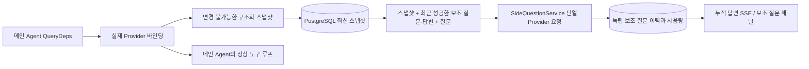

# ARTEX `/btw`

일반 채팅, 작업 MainAgent 및 현재 작업의 Worker는 독립 보조 질문을 지원합니다. 메인 입력란에 `/btw 问题`를 입력하면 제출할 수 있으며, 질문이 없는 `/btw` 또는 “보조 질문” 버튼으로 이력을 엽니다. 데스크톱은 너비를 조절할 수 있는 사이드바를, 모바일은 Drawer를 사용합니다.

보조 질문 답변은 제출 시점의 Agent 컨텍스트 스냅샷을 기반으로 생성하며, 스트리밍 표시·후속 질문·중지·비우기를 지원합니다. 패널을 닫거나 페이지를 새로고침하거나 SSE 연결을 끊어도 모델 요청은 취소되지 않습니다. 중지는 현재 보조 질문에만 영향을 줍니다. 비우기는 보조 질문을 취소하고 보조 질문 이력을 삭제하면서 메인 컨텍스트 스냅샷을 유지합니다.

## 구현 경계

Go, norma v0.3.7, Next.js 및 기존 Markdown / ResizablePanel / Drawer / AlertDialog 컴포넌트를 그대로 사용하며, norma 소스를 수정하거나 보조 질문을 위해 의존성을 추가하지 않았습니다. Planner, 다른 작업에서 상속한 Worker, 도구형 하위 작업의 업그레이드는 이번 범위 밖입니다.

- `capture.go`는 `Options.Deps.CallModel / CallModelSync`에서만 메인 루프 요청을 표시합니다. Provider 데코레이터는 구체적인 모델 내부이자 라우팅 풀의 외부 선택 이후에 있으므로 실제 선택한 모델을 기록합니다. 압축과 요약 요청은 스냅샷을 덮어쓰지 않습니다.
- 요청 시작, 완전한 모델 응답, 실행 종료 상태에서 스냅샷을 공개합니다. 생성 중인 일부 응답은 공개하지 않습니다. 도구 호출은 norma의 `MessagesForAPI`로 쌍을 유지하며, 도구 결과는 다음 메인 모델 요청 또는 실행 종료 상태에서 스냅샷에 들어갑니다. 스트리밍이 중단되면 직전의 유효한 경계를 유지합니다.
- 스냅샷은 JSON 깊은 복사로 구조화 메시지, 시스템 프롬프트, 도구 정의 및 생성 파라미터를 유지합니다. 모델 추론 중에는 스냅샷 잠금이나 데이터베이스 트랜잭션을 유지하지 않습니다.
- `SideQuestionService`는 구체적인 Provider를 호출하며, 필요한 경우 보조 질문 요약을 먼저 생성합니다. 최종 답변은 처음으로 컨텍스트 상한을 넘었고 아직 텍스트/도구 호출을 출력하지 않았을 때만 축소 후 한 번 재시도할 수 있습니다. agent session을 생성하지 않으며 도구 실행기·메인 transcript·활동 스트림·작업 그래프에 연결하지 않고, 작업 모델 전환 체인도 거치지 않습니다. 답변에 도구 정의를 유지하는 것은 기존 구조화 도구 컨텍스트와 호환하기 위해서이며, 요약 요청에는 도구를 제공하지 않습니다. 새로 반환된 도구 호출에는 실행 경로가 없습니다.
- 부모 세션마다 실행 요청은 하나이며, 단일 서비스 프로세스에는 최대 네 개, 단일 타임아웃은 120초입니다. 보조 질문은 서비스 생명주기 아래의 독립 취소 컨텍스트를 사용합니다.
- 보조 질문 요청은 모델 설정 참조와 민감하지 않은 식별 요약을 유지하며, 요청 시 기존 설정에서 자격 증명을 가져옵니다. 설정이 삭제되거나 모델·프로토콜·주소 등의 식별 필드가 바뀌면 먼저 메인 Agent를 실행해 스냅샷을 갱신해야 합니다. 테스트는 제품 기본 모델을 바꾸지 않습니다.

## 영구 저장과 복구

`db/schema.sql`은 `side_question_sessions` 및 `side_question_requests`를 자동 생성합니다. 전자는 부모 리소스·최신 스냅샷·실행 번호·버전·정리 버전을 저장하며, 후자는 질문·누적 답변·상태·모델·스냅샷 시각·사용량·이벤트 순번·페이지네이션 순번을 저장합니다.

부모 세션 키는 conversation ID 또는 task ID + exploration ID + intent ID를 사용합니다. Worker는 재사용할 수 있는 실행 슬롯으로 이름을 정하지 않습니다.

스냅샷은 부모 세션별로 병합해 기록하며 250 ms마다 갱신합니다. 데이터베이스가 `(run_id, version)`을 비교해 이전 버전의 덮어쓰기를 방지합니다. 보조 질문 제출 전 선택한 스냅샷을 다시 저장합니다. 저장에 성공하면 메모리의 큰 스냅샷을 해제하고, 실패하면 기록 대기 버전을 유지합니다. 누적 답변은 스트리밍 이벤트가 도착할 때 250 ms당 최대 한 번 기록하며, 종료 상태는 즉시 저장하고 데이터베이스 오류 시 제한적으로 재시도합니다.

서비스 시작 시 남아 있는 `running` 요청을 `interrupted`로 표시하고, 이미 저장한 일부 답변과 사용량을 유지하며 요청을 자동 재실행하지 않습니다. 최근에 성공적으로 저장한 컨텍스트를 다음 질문에 바로 사용할 수 있습니다. 기존 세션에 스냅샷이 없으면 먼저 메인 Agent를 실행해야 하며, UI 활동 기록으로 컨텍스트를 재구성하지 않습니다.

비우기 동작은 정리 버전을 증가시키고 요청을 삭제합니다. 조건부 갱신으로 늦게 도착한 콜백의 재기록을 막습니다. 부모 리소스의 물리 삭제는 외래 키 연쇄 삭제에 의존하며, Worker 논리 삭제는 동일 트랜잭션에서 보조 질문 데이터를 삭제하고 이후 늦게 도착한 스냅샷을 거부합니다. 작업 아카이브는 먼저 새 요청을 막고 메인 흐름의 중지를 기다린 뒤, 보조 질문을 취소하고 저장을 기다립니다. 아카이브 형식은 v3이며 보조 질문 테이블이 없는 v1/v2와도 호환됩니다.

이력은 완전하게 저장하며 순번 커서로 페이지당 최대 20개를 반환합니다. 모델 요청에는 최근 성공한 질의응답 원문을 최대 20쌍 재생하고 token 예산으로 재생량도 제한합니다. 오래된 질의응답은 독립적인 누적 갱신 요약으로 유지합니다. 메인 컨텍스트가 예산을 초과하면 보조 질문 복사본의 오래된 부분만 요약하고 최근 구조화 도구 호출과 결과는 유지합니다. 요약, 준비 진행 상황 및 사용량은 함께 보조 질문의 동시 실행, 취소 및 120초 타임아웃 제한에 포함됩니다. 자세한 내용은 [컨텍스트 예산과 오픈 소스 참고](CONTEXT_BUDGET.md) 참조.

## HTTP 계약

다음 경로를 `{parent}`로 사용하며, 기존 인증과 리소스 검증을 유지합니다:

- `/api/conversations/{id}`
- `/api/tasks/{id}/chat`
- `/api/tasks/{id}/intents/{iid}`

| 요청 | 반환 및 동작 |
| --- | --- |
| `GET {parent}/side-questions?before={ordinal}` | `items`는 최신순으로 정렬하며, 독립 `current` 실행 상태·`snapshot` 메타 정보·`next_cursor`를 포함합니다. 커서 0은 최신 페이지 / 다음 페이지 없음을 뜻합니다 |
| `POST {parent}/side-questions` | JSON `{ "question": "…", "client_request_id": "UUID" }`. 새 요청은 202 및 요청 객체를 반환하며, 같은 ID와 질문은 기존 객체를 200으로 반환합니다 |
| `DELETE {parent}/side-questions` | 현재 부모 세션의 보조 질문·답변을 취소하고 비웁니다 |
| `GET /api/side-questions/{requestID}/events` | `snapshot` SSE 이벤트. `id`는 증가하는 순번이고 `data`는 완전한 누적 요청 객체이며, 비울 때 `cleared`를 전송합니다 |
| `POST /api/side-questions/{requestID}/cancel` | 명시적 취소. 종료 상태는 이력 또는 SSE에서 읽을 수 있습니다 |

질문 상한은 4000자입니다. 스냅샷 없음·모델 설정 변경·동일 부모 세션 사용 중·멱등 ID 충돌은 409를, 전역 동시 실행 상한은 429를 반환합니다. SSE 연결마다 누적 상태를 먼저 전송하며, 클라이언트가 앞서 받은 텍스트 조각에 의존하지 않습니다. 프런트엔드는 요청 ID + 순번으로 병합하며 부모 세션 전환·비우기 시 이전 콜백을 폐기합니다.

## 검증과 참고

자동화 검사, 실제 모델 사용 및 알려진 제한은 [VALIDATION.md](VALIDATION.md)를 참조합니다.

독립 요청은 [Grok CLI side-question.ts(고정 커밋)](https://github.com/superagent-ai/grok-cli/blob/fb97af83f06dca873281d60168430f06c8de6324/src/utils/side-question.ts)를, 실행 격리는 [OpenCode(고정 커밋)](https://github.com/anomalyco/opencode/tree/b3f1a96c6dd7adeb28b36dd11add1998fc84d67b)를 참조합니다. ARTEX 컨텍스트는 norma의 구조화 메시지를 사용하며, 프런트엔드 로그의 텍스트를 이어 붙이는 방식을 채택하지 않았습니다.
