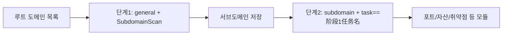

---

name: scopesentry
description: ScopeSentry MCP를 통해 보안 스캔 플랫폼(프로젝트, 작업, 템플릿, 자산, 노드)을 관리합니다. 사용자가 ScopeSentry, MCP, API Key, 스캔 작업, 자산 조회를 언급할 때 사용합니다.
---

# ScopeSentry MCP 사용 안내

**ScopeSentry 인스턴스를 이미 배포한** 사용자를 대상으로 합니다. Cursor(또는 다른 MCP 클라이언트)를 통해 플랫폼에 연결하며, 로컬 소스 코드는 필요하지 않습니다.

## 1. 준비 작업

### 1.1 서비스 접근 가능 여부 확인

- 기본 Web 화면: `http://<主机>`
- MCP 엔드포인트: `http://<主机>/mcp`(앞에 리버스 프록시나 프런트엔드 프록시가 있으면 실제 `/mcp` 주소를 기준으로 합니다)

### 1.2 API Key 생성

1. 브라우저에서 ScopeSentry Web 화면에 로그인합니다
2. **API Key** 관리 페이지에서 키를 생성합니다(또는 관리자가 제공한 엔드포인트를 통해 생성합니다)
3. 반환된 `ssk_...` 문자열을 저장합니다(**한 번만 표시됩니다**)

### 1.3 Cursor MCP 설정

Cursor → Settings → MCP → 서버 추가:

```json
{
  "mcpServers": {
    "scopesentry": {
      "url": "http://<你的主机>:8082/mcp",
      "headers": {
        "X-API-Key": "ssk_你的密钥"
      }
    }
  }
}
```

다음도 사용할 수 있습니다: `Authorization: Bearer ssk_你的密钥`

설정 후 MCP를 다시 시작하거나 Cursor를 다시 로드하고, 도구 목록에 `list_projects`, `list_assets` 등이 나타나는지 확인합니다.

---

## 2. 도구 목록


| 도구                     | 용도                |
| ---------------------- | ----------------- |
| `list_projects`        | 태그별로 그룹화한 프로젝트 트리(프로젝트 ID 포함) |
| `list_projects_data`   | 페이지 단위 프로젝트 목록, 이름으로 검색 가능     |
| `get_project`          | 프로젝트 상세              |
| `create_project`       | 프로젝트 생성              |
| `list_tasks`           | 스캔 작업 목록            |
| `get_task`             | 작업 상세              |
| `list_scan_templates`  | 스캔 템플릿 목록            |
| `get_scan_template`    | 템플릿 상세              |
| `list_plugin_modules`  | 스캔 파이프라인 모듈명          |
| `list_plugins`         | 사용 가능한 플러그인(hash, 기본 파라미터 포함) |
| `create_scan_template` | 스캔 템플릿 생성            |
| `create_scan_task`     | 스캔 작업 생성            |
| `list_assets`          | 다양한 자산 조회(페이지 단위 목록)       |
| `count_assets`         | 자산 개수 집계(`/api/assets/common/total`) |
| `get_asset_detail`     | 자산 또는 취약점 상세           |
| `add_asset_tag`        | 자산에 태그 추가           |
| `list_nodes`           | 스캔 노드 목록            |


각 도구의 파라미터는 MCP 도구 설명(schema)을 기준으로 합니다. `list_assets` / `count_assets`의 search, filter 문법은 같으며, 자산을 조회하기 전에 `list_assets` description을 먼저 읽을 수 있습니다.

'총 몇 개인지' 알아야 할 때는 `count_assets`를 사용합니다(Web 페이지네이션의 전체 개수 엔드포인트에 대응). 전체 개수를 세기 위해 `list_assets`의 페이지를 반복해서 조회할 필요는 없습니다.

---

## 3. 자주 사용하는 작업 흐름

### 3.1 프로젝트별 자산 조회

사용자나 컨텍스트에 **프로젝트 조건이 이미 있으면**, 우선 `filter.project`로 범위를 좁혀 여러 프로젝트의 데이터가 너무 많아 응답이 느려지는 것을 방지합니다. 명확한 프로젝트가 없으면 프로젝트 필터를 강제하지 않아도 됩니다.

1. `list_projects` 또는 `list_projects_data`로 대상 프로젝트의 **ObjectID**를 가져옵니다(`id` / `children[].value`)
2. `list_assets`에 `filter.project`를 전달합니다(**반드시 ID여야 하며, 프로젝트의 중국어 이름을 넣으면 안 됩니다**)

```json
{
  "asset_type": "asset",
  "pageIndex": 1,
  "pageSize": 20,
  "search": "domain=^example.com",
  "filter": {
    "project": ["<项目ObjectID>"]
  }
}
```

### 3.2 스캔 작업 생성

1. `list_nodes`로 온라인 노드 이름을 가져옵니다
2. `list_scan_templates` 또는 `create_scan_template`으로 템플릿 **ObjectID**를 가져옵니다
3. `create_scan_task`: `name`, `node`는 필수이며, `template`에는 템플릿 ID를 넣습니다(템플릿 이름을 넣으면 안 됩니다)

**대상 출처 `targetSource`(Web과 동일):**

| targetSource | 설명 | 필수 파라미터 |
| --- | --- | --- |
| `general` | 대상 직접 입력 | `target` |
| `project` | 프로젝트에서 대상 읽기 | `project`(프로젝트 ObjectID 배열) |
| `asset` | Web 자산 저장소에서 검색 | `search`; 선택 사항: `project`, `filter`, `targetNumber` |
| `RootDomain` | 루트 도메인 저장소에서 검색 | `search`; 선택 사항: `project`, `filter`, `targetNumber` |
| `subdomain` | 서브도메인 저장소에서 검색 | `search`; 선택 사항: `project`, `filter`, `targetNumber` |
| `UrlScan` | URL 스캔 결과에서 검색 | `search`; 선택 사항: `project`, `filter`, `targetNumber` |
| `*Source`(예: `subdomainSource`) | 자산 페이지의 '선택/검색'에서 생성 | `targetTp=search`이면 `search` 사용; `targetTp=select`이면 `targetIds` 사용 |

**예시 — 루트 도메인 직접 스캔:**

```json
{
  "name": "example-子域名收集",
  "node": ["node-1"],
  "template": "<模板ObjectID>",
  "targetSource": "general",
  "target": "example.com\nfoo.com",
  "project": ["<项目ObjectID>"]
}
```

**예시 — 서브도메인 저장소에서 이어서 스캔(이전 작업명으로 필터링):**

```json
{
  "name": "example-端口与漏洞",
  "node": ["node-1"],
  "template": "<后续模块模板ObjectID>",
  "targetSource": "subdomain",
  "search": "task==\"example-子域名收集\"",
  "project": ["<项目ObjectID>"]
}
```

### 3.3 루트 도메인의 전체 정보 수집(두 단계 권장)

입력이 **루트 도메인**이고 **전체 정보 수집**을 수행하려면 두 번으로 나누어 스캔하는 것을 권장하며, 전체 파이프라인을 한 번에 실행하지 마세요.

**이유:** 분산 처리 작업은 **개별 대상** 단위로 노드에 배정됩니다. 루트 도메인이 대상이면 특정 노드에 해당 루트 도메인이 배정된 뒤 그 노드에서 스캔한 서브도메인도 계속 같은 노드에서 후속 모듈을 실행하므로 부하 불균형, 속도 저하, 오류가 발생하기 쉽습니다.

**권장 방식:**

1. **첫 번째 단계 — 서브도메인 수집만 수행**
   - `targetSource`: `general`
   - `target`: 모든 루트 도메인(여러 줄)
   - 템플릿: `SubdomainScan`, `SubdomainSecurity`만 활성화(서브도메인 스캔 + 서브도메인 탈취)
   - `get_task`로 작업 완료를 기다립니다

2. **두 번째 단계 — 후속 모듈**
   - `targetSource`: `subdomain`
   - `search`: `task=="<第一阶段任务名称>"`(작업명 정확 일치)
   - 선택 사항인 `project`로 범위를 좁힙니다
   - 템플릿: 포트 스캔, 자산 매핑, 취약점 스캔 등(SubdomainScan은 제외 가능)
   - 서브도메인을 독립된 대상으로 각 노드에 분배하여 병렬 처리 효율을 높입니다

Web 화면의 '서브도메인' 자산 페이지에서도 작업명으로 필터링한 뒤 '서브도메인으로 작업 생성'을 사용하면 효과가 같습니다.



### 3.4 스캔 템플릿 생성

1. `list_plugin_modules` → 모듈명 목록
2. `list_plugins`(`module`로 필터링 가능) → 각 플러그인의 `hash`와 기본 `parameter`
3. `create_scan_template`: `modules`로 '모듈 → 플러그인 hash 배열'을 지정합니다

---

## 4. 자산 조회(`list_assets` / `count_assets`)

`count_assets`는 `list_assets`와 같은 `asset_type`, `search`, `filter`를 사용하며, `{ "total": N }`을 반환합니다. Web의 `/api/assets/common/total`에 대응합니다.

```json
{
  "asset_type": "subdomain",
  "search": "task==\"某任务名\"",
  "filter": {"project": ["<项目ObjectID>"]}
}
```

**성능 권장 사항(`list_assets` / `count_assets` 공통):** 프로젝트 조건이 있으면 우선 `filter.project`로 범위를 좁힙니다. `search`에서 인덱스가 생성된 필드는 가능한 한 `==` 완전 일치나 `^` 접두사 매칭을 사용하고([4.3](#43-search-검색-표현식) 참조), 광범위한 `=` 부분 일치 조회로 응답이 느려지는 것을 피합니다. 프로젝트 컨텍스트가 없으면 프로젝트 필터를 강제하지 않습니다.

`filter.project`를 지원하는 유형은 [4.4](#44-filter-정확-필터링)의 표를 참조합니다.

### 4.1 자산 유형 `asset_type`

`asset`, `RootDomain`, `subdomain`, `app`, `mp`, `UrlScan`, `SensitiveResult`, `DirScanResult`, `crawler`, `vulnerability`, `PageMonitoring`, `IPAsset`, `SubdomainTakerResult`

별칭 예시: `web`→asset, `vuln`→vulnerability, `ip`→IPAsset, `url`→UrlScan

### 4.2 파라미터 설명


| 파라미터                       | 설명                                      |
| ------------------------ | --------------------------------------- |
| `pageIndex` / `pageSize` | 페이지네이션, 기본값 1 / 20                            |
| `search`                 | 검색 표현식(다음 절 참조)                              |
| `filter`                 | 정확 필터링 JSON(다음 절 참조)                          |
| `sort`                   | UrlScan, DirScanResult만 `length` 기준 정렬 지원 |
| `sid`                    | SensitiveResult만 해당: 민감정보 규칙명                |


`search`와 `filter`는 **동시에 사용할 수 있습니다**.

### 4.3 search 검색 표현식

사용자 정의 DSL(**SQL이 아님**):


| 연산자  | 의미   | 인덱스 | 예시                          |
| ---- | ---- | ---- | --------------------------- |
| `=`  | 부분 일치(regex) | 인덱스 미사용 | `domain=example`            |
| `==` | 정확 일치(완전 일치) | **인덱스 사용** | `port==443`                 |
| `!=` | 제외   | — | `port!="80"`                |
| `&&` | 그리고    | — | `domain==example.com && port==443` |
| `||` | 또는    | — | `title=admin || body=login` |


**인덱스와 연산자:** `domain`, `ip`, `port`, `title` 등의 필드에는 인덱스가 생성되어 있지만, **`==` 완전 일치** 또는 **값이 `^`로 시작하는 접두사 매칭**(예: `domain=^example.com`)만 인덱스를 사용할 수 있습니다. **`=`는 regex 부분 일치로 변환되어 인덱스를 사용할 수 없으며**, 데이터가 많으면 느려지기 쉽습니다.

**모든 유형의 공통 search 필드:** `tag`, `task`(작업명), `rootDomain`

**project는 search 안에 넣으면 안 됩니다**(유효하지 않거나 `&&`와 결합하면 오류 발생). 프로젝트 필터링은 `filter.project`를 사용합니다.

**각 유형에서 자주 사용하는 search 필드:**


| asset_type           | 필드                                                                                  |
| -------------------- | ----------------------------------------------------------------------------------- |
| asset                | domain, ip, port, service, app, title, statuscode, icon, banner, type, body, header |
| RootDomain           | domain, icp, company                                                                |
| subdomain            | domain, ip, type, value                                                             |
| app                  | name, icp, company, category, description, url, apk                                 |
| mp                   | name, icp, company, category, description, url                                      |
| UrlScan              | url, input, source, resultId, type                                                  |
| SensitiveResult      | url, sname, body, info, md5                                                         |
| DirScanResult        | url, statuscode, redirect, length                                                   |
| vulnerability        | url, vulname, matched, request, response, level                                     |
| crawler              | url, method, body, resultId                                                         |
| PageMonitoring       | url, hash, diff, response                                                           |
| IPAsset              | ip, domain, port, service, webServer, app                                           |
| SubdomainTakerResult | domain, value, type, response                                                       |


**search 예시:**

- `domain==www.example.com && port==443`(완전 일치, 인덱스 사용)
- `domain=^example.com`(접두사 매칭, 인덱스 사용)
- `ip==192.168.1.1`
- `task=="某任务名"`
- `level==high`(vulnerability)
- `statuscode==200`(DirScanResult)

부분 포함이 필요할 때만 `=`를 사용합니다. 예: `title=admin`(인덱스 미사용, 프로젝트 등의 조건으로 범위를 좁히는 것을 권장).

### 4.4 filter 정확 필터링

JSON 객체: 같은 key의 여러 값은 **OR**, 다른 key는 **AND**입니다.

**프로젝트 조건이 있으면 우선 `project`를 사용합니다:** 사용자나 컨텍스트에서 프로젝트가 명확하고 asset_type이 `project`를 지원하면 범위를 좁히도록 포함해야 합니다. 프로젝트 정보가 없으면 강제하지 않습니다.


| filter key   | 의미       | 값 설명                                                     |
| ------------ | -------- | -------------------------------------------------------- |
| `project`    | 소속 프로젝트     | **ObjectID**, `list_projects` / `list_projects_data`로 조회 |
| `task`       | 출처 작업     | **작업명**, `list_tasks`의 `name` 사용                         |
| `port`       | 포트       | 예: `"443"`                                                |
| `service`    | 서비스/프로토콜    | 예: `"https"`                                              |
| `app`        | 애플리케이션 핑거프린트     | 예: `"Nginx"`                                              |
| `icon`       | 아이콘 hash  |                                                          |
| `statuscode` | HTTP 상태 코드 | 주로 asset에 사용                                               |
| `status`     | 상태       | UrlScan/DirScan HTTP 코드; 취약점/민감정보 처리 상태                       |
| `level`      | 취약점 등급     | critical / high / medium / low / info                    |
| `type`       | 유형       | 예: 서브도메인 레코드 유형 A, CNAME                                         |
| `color`      | 민감정보 규칙 색상   | SensitiveResult                                          |
| `sname`      | 민감정보 규칙명    | SensitiveResult                                          |
| `tags`       | 태그       |                                                          |


**각 유형에서 사용 가능한 filter key:**


| asset_type                            | filter key                                                      |
| ------------------------------------- | --------------------------------------------------------------- |
| asset                                 | project, port, service, app, icon, statuscode, type, task, tags |
| RootDomain                            | project, tags                                                   |
| subdomain                             | project, type, task, tags                                       |
| app / mp                              | project, tags                                                   |
| UrlScan                               | status, tags                                                    |
| DirScanResult                         | status, tags                                                    |
| SensitiveResult                       | status, color, sname, tags                                      |
| crawler                               | project, task, tags                                             |
| vulnerability                         | project, level, status, task, tags                              |
| PageMonitoring / SubdomainTakerResult | tags                                                            |
| IPAsset                               | project, port, service, app                                     |


**filter 예시:**

```json
{"project": ["<项目ObjectID>"], "port": ["443"]}
```

**조합 조회 예시:**

```json
{
  "asset_type": "asset",
  "search": "domain=^baidu && port==443",
  "filter": {"project": ["<项目ObjectID>"]},
  "pageIndex": 1,
  "pageSize": 10
}
```

**주의:**

- 프로젝트 조건이 있으면 우선 `filter.project`를 포함합니다(지원하는 경우). 프로젝트 컨텍스트가 없으면 강제하지 않아도 됩니다
- `filter.project`에 프로젝트 표시 이름을 넣으면 안 됩니다
- 알려진 값은 `==`, 접두사는 `^`를 사용합니다. 큰 테이블에서 `=` 부분 일치를 남용하지 않습니다
- UrlScan의 HTTP 상태는 `filter.status`를 사용합니다. DirScanResult는 search에 `statuscode==200`을 사용할 수 있습니다
- SensitiveResult를 규칙명으로 조회: `search`에 `sname=规则名`을 사용하거나 `filter.sname` 사용

### 4.5 정렬 sort

**UrlScan**, **DirScanResult**만 지원합니다:

```json
{"length": "ascending"}
```

다른 유형은 `sort`를 무시하고 시간 기준으로 기본 정렬합니다.

---

## 5. 스캔 템플릿 모듈명

`TargetHandler`, `SubdomainScan`, `SubdomainSecurity`, `PortScanPreparation`, `PortScan`, `PortFingerprint`, `AssetMapping`, `AssetHandle`, `URLScan`, `WebCrawler`, `URLSecurity`, `DirScan`, `VulnerabilityScan`, `PassiveScan`

---

## 6. 문제 해결


| 현상        | 처리                                                 |
| --------- | -------------------------------------------------- |
| MCP 도구 없음   | URL, API Key, ScopeSentry 실행 여부 확인                    |
| 401 / 403 | API Key를 다시 생성하거나 교체                                    |
| 자산을 찾을 수 없음     | `filter.project`가 ObjectID인지 확인; search에 project를 넣으면 안 됨 |
| 템플릿/작업 생성 실패 | `template`은 반드시 템플릿 ObjectID; `node`에는 온라인 노드명 입력            |
| 조회가 느리거나 멈춤   | 프로젝트가 있으면 `filter.project` 추가; search에서 인덱스가 생성된 필드는 `==` 또는 `^` 접두사로 변경하고 `=` 사용을 줄임; `pageSize` 축소 |


---

